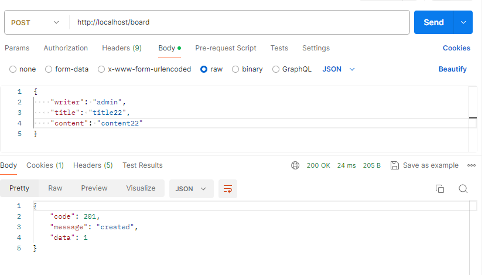

<<<<<<< HEAD
# S1114_SPRING_HOME_Kimsanghyun_Shinhyejin_TakDaeyeol

# 요구사항 목록

- 회원 정보 관리
- 아파트 매매 실거래가 조회(전체 조회, 동별 조회, 아파트별 조회)
- 동네 업종 정보 조회
- 동네 환경 정보 조회
- 로그인, 로그아웃


# 실행 스크린샷

## 회원 정보 관리

### 1. 전체 회원 조회


### 2. 회원 등록


### 3. 회원 수정


### 4. 회원 번호로 조회


### 5. 회원 삭제


### 6. 회원 이름으로 조회


### 7. 회원 로그인


## 아파트 매매 실거래가 조회(전체 조회, 동별 조회, 아파트별 조회)

### 1. 전체 조회


### 2. 동별 조회


### 3. 아파트별 조회


## 추가 기능

### 1. 상권 상세 조회 (동 코드 입력)


### 2. 상권 카테고리 수 조회 (동 코드 입력)


### 3. 동네 환경 정보 조회 (구 이름 or 코드 입력)


## 심화 기능

### 게시판 CRUD




=======
# Vue


## Getting started

```
cd vue
npm install
npm run dev
```
>>>>>>> 29205623a491d1b5716c8a03455461f600e2dea0
